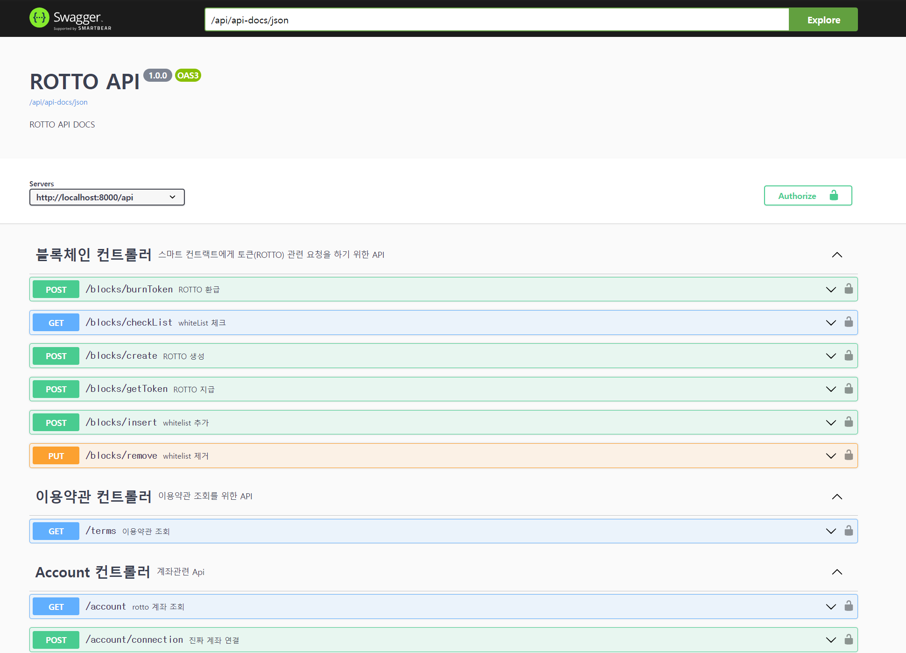

# ☕ ROTTO

 

# 목차

1. [개요](#🏕-개요)
2. [서비스 및 기능 소개](#🕹-서비스-및-기능-소개)
3. [개발 환경](#🛠-개발-환경)
4. [설계 문서](#📄-설계-문서)
5. [팀원 소개](#👨‍👨‍👧👨‍👧‍👦-팀원-소개)

  

# 🏕 개요

> **💻프로젝트 기간** : 2024.04.08 (월) ~ 2024.05.20 (월)   **서비스 URI** : [ROTTO](https://k10e105.p.ssafy.io)   **참고 영상** : [UCC](https://youtu.be/Hqd4q7OwwAw?si=jjrR8Sl_0232MISs)

## 🏞 기획 배경
> 20·30대의 투자 비율은  23.90% -> 39.20%로 꾸준히 증가  
> 국내 1인당 연간 커피 소비량은 405잔이며, 세계 2위에 해당하는 수준  
> 고급 원두는 고부가가치를 가지며 커피는 남녀노소 선호하는 기호 식품

## 🎯 목표
> 빚투와 같은, 리스크를 수반하는 투자보다는 안정적인 투자 서비스를 만들고자 함
 

# 🕹 서비스 및 기능 소개

## 서비스 화면

### 시작하기
|  |  |
| :---------------------: | :------------------------------: |
| **스플래쉬** | **온보딩** |
| 애플리케이션을 통해 실행합니다. | 서비스에 대해 간단히 알아볼 수 있습니다. |
|  |  |
| **회원가입** | **로그인** |
| 필요한 정보를 입력하여 회원가입할 수 있습니다. | 전화번호와 비밀번호, 간편비밀번호를 입력하여 로그인할 수 있습니다. |

  

### 홈
|  |  |
| :-----------------------------: | :------------------------------: |
| **공지사항** | **FAQ** |
| 배너와 게시판을 통해 공지사항을 확인할 수 있습니다. | 배너와 게시판을 통해 FAQ를 확인할 수 있습니다. |
|  |  |
| **관심 농장** | **소식** |
| 관심 농장 등록한 농장을 조회할 수 있습니다. | 해외의 커피 관련 뉴스를 볼 수 있습니다. |

  

### 발견
|  |  |
| :-----------------------------: | :------------------------------: |
| **메인** | **농장 조회** |
| 농장 목록과 원두 소개, 이전 청약 수익률 TOP 10 농장을 확인할 수 있습니다. | 농장의 지난 수익률, 원두, 수상내역 등을 조회할 수 있으며 관심 농장으로 등록할 수 있습니다. |

  

### 청약
|  |  |
| :----------------: | :----------------: |
| **청약 조회** | **청약 신청** |
| 검색 및 필터링을 통해 청약 목록을 조회할 수 있습니다. | 청약 상세 조회 및 청약 신청을 할 수 있습니다. |

  

### My
|  |  |
| :----------------: | :----------------: |
| **계좌 연동** | **입출금내역 조회** |
| 자신의 금융 계좌를 연동할 수 있습니다. | 입출금내역을 조회할 수 있습니다. |
|  |  |
| **계좌 채우기** | **연동 계좌로 보내기** |
| 연동 계좌 -> 가상 계좌로 돈을 채울 수 있습니다. | 가상 계좌 -> 연동 계좌로 돈을 보낼 수 있습니다. |
|  |  |
| **전자 지갑 연동** | **토큰 발급과 환급** |
| MetaMask를 통해 전자 지갑을 연동할 수 있습니다. | 청약 신청을 통해 토큰을 발급 받고 정산을 통해 환급받을 수 있습니다. |
|  |
| **정산 내역과 해지 내역 조회** |
| 청약 정산 내역과 해지 내역을 조회할 수 있습니다. |

  

### 설정
|  |  |  |
| :----------------: | :----------------: | :----------------: |
| **비밀번호 변경** | **간편 비밀번호 변경** | **문의하기** |
| 비밀번호를 변경할 수 있습니다. | 간편 비밀번호를 변경할 수 있습니다. | 문의글을 작성할 수 있습니다. |

  

# 🛠 개발 환경
### ⚙ Management Tool
> 이슈 관리 : Jira  
> 형상 관리 : Gitlab  
> 빌드/배포 관리 : Jenkins `2.426.3`  
> 커뮤니케이션 : Mattermost, Notion, Discord  
> 디자인 : Figma

 

### 💻 IDE
> Visual Studio Code `1.85.1`   
> IntelliJ IDEA `2023.3.2` (Community Edition)

 

### 🛢 Back-End
> - Language: Java 17
> - Framework:
>   -  Spring Boot: `3.2.1`
>   -  Spring Security: `3.2.1`
>   -  Spring Data JPA
> - 주요 Libraries:
>   - Lombok
>   - JJwt: `0.11.5`
> -  개발 도구:
>   -  Spring Boot Devtools
>   -  Gradle `8.5`
> -  API 문서화:
>   -  Swagger
> - 데이터베이스:
>   - MySQL `8.0.35`
>   - Redis `7.0.2`

 

### 📱 Front-End
> - lang: JAVASCRIPT, Node.js `21.5.0` 
> - Framework: 
>   - react-native: `0.73.5`
> - 주요 Libraries
>   - reduxjs/toolkit: `2.2.1`
>   - axios: `1.6.7`
>   - web3modal: `1.3.0`
>   - wagmi: `1.4.13`
>   - firebase `10.8.1`
> - build 환경
>   - expo: `~ 50.0.13`

 

### 🔒🔗⛓₿ BlockChain
> - Language: Solidity `8.0.19`
> - Framework:
>   - Truffle: `5.11.5`
> - 주요 Libraries:
>   - openzeppelin/contracts: `4.9.6`
>   - truffle/hdwallet-provider: `2.1.15`
>   - dotenv: `16.4.5`

 

### 🌐 Server
> - AWS EC2
>   - Ubuntu `20.04 LTS`
>   - Nginx `1.18.0`(ubuntu)
>   - Docker `25.0.1`
>   - docker-compose `2.24.2`
>   - Https/SSL `Let's Encrypt`
> - AWS S3 Bucket

  

# ⛺ 아키텍처

  

# 📄 설계 문서
## 요구사항 및 기능 정의서

  

## API 명세서

  

## Swagger

  

## ERD

  

# 👨‍👨‍👧👨‍👧‍👦 팀원 소개

